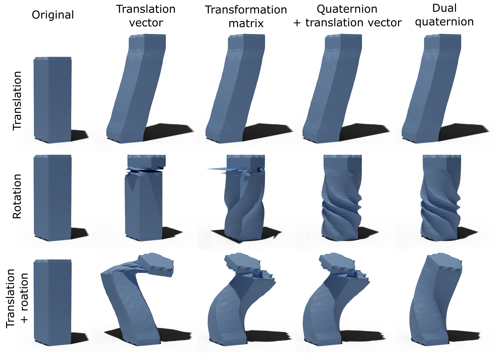

# Demo
Runnable examples can be found in **TVMEditor.Test** project. It contains a comparison of the following representations of transformations:
 - Translation vectors
 - Transformation matrices
 - Translation vectors + quaternions
 - Dual quaternions (used in a paper)



To run this example just build the project and run test.bat:

```shell
git clone https://gitlab.com/hachaf/tvm-editing.git
cd tvm-editing
test.bat
```

