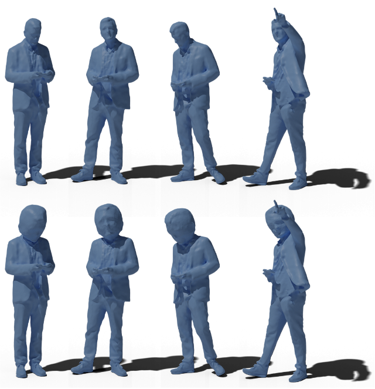

# Editing Mesh Sequences with Varying Connectivity
This repository contains implementation of framework for editing time-varying meshes, which has been proposed in:

Filip Hácha, Jan Dvořák, Zuzana Káčereková, Libor Váša: Editing mesh sequences with varying connectivity, Computers & Graphics, Volume 121, 2024, 103943, ISSN 0097-8493, https://doi.org/10.1016/j.cag.2024.103943.  



## Abstract
Time-varying connectivity of triangle mesh sequences leads to substantial difficulties in their processing. Unlike editing sequences with constant connectivity, editing sequences with varying connectivity requires addressing the problem of temporal correspondence between the frames of the sequence. We present a method for time-consistent editing of triangle mesh sequences with varying connectivity using sparse temporal correspondence, which can be obtained using existing methods.
Our method includes a deformation model based on the usage of the sparse temporal correspondence, which is suitable for the temporal propagation of user-specified deformations of the edited surface with respect to the shape and true topology of the surface while preserving the individual connectivity of each frame. Since there is no other method capable of comparable types of editing on time-varying meshes, we compare our method and the proposed deformation model with a baseline approach and demonstrate the benefits of our framework. 

## Requirements
 - .NET framework 5.0

## Links
 - [Demo](Documentation/demo.md)
 - [Documentation](Documentation/documentation.md)
 - [Preprint](https://arxiv.org/abs/2405.04957)
 - [Paper](https://doi.org/10.1016/j.cag.2024.103943)
 - [Replicability Stamp](http://www.replicabilitystamp.org/#https-gitlab-com-hachaf-tvm-editing-git)

## Citation
```text
@article{Hacha2024,
title = {Editing mesh sequences with varying connectivity},
journal = {Computers & Graphics},
volume = {121},
pages = {103943},
year = {2024},
issn = {0097-8493},
doi = {https://doi.org/10.1016/j.cag.2024.103943},
url = {https://www.sciencedirect.com/science/article/pii/S0097849324000785},
author = {Filip Hácha and Jan Dvořák and Zuzana Káčereková and Libor Váša},
keywords = {Computer graphics, Animation, Shape modeling},
abstract = {Time-varying connectivity of triangle mesh sequences leads to substantial difficulties in their processing. Unlike editing sequences with constant connectivity, editing sequences with varying connectivity requires addressing the problem of temporal correspondence between the frames of the sequence. We present a method for time-consistent editing of triangle mesh sequences with varying connectivity using sparse temporal correspondence, which can be obtained using existing methods. Our method includes a deformation model based on the usage of the sparse temporal correspondence, which is suitable for the temporal propagation of user-specified deformations of the edited surface with respect to the shape and true topology of the surface while preserving the individual connectivity of each frame. Since there is no other method capable of comparable types of editing on time-varying meshes, we compare our method and the proposed deformation model with a baseline approach and demonstrate the benefits of our framework.}
}
```


## Commands

dotnet build  TVMEditor.sln --configuration Release --no-incremental

TVMEditor.Test\bin\Release\net5.0\TVMEditor.Test.exe "TVMEditor.Test/bin/Release/net5.0/Data/pent" "TVMEditor.Test/bin/Release/net5.0/output"


TVMEditor.Test\bin\Release\net5.0\TVMEditor.Test.exe "TVMEditor.Test/bin/Release/net5.0/Data/Levi" "TVMEditor.Test/bin/Release/net5.0/output"

TVMEditor.Test\bin\Release\net5.0\TVMEditor.Test.exe "TVMEditor.Test/bin/Release/net5.0/Data/Dancer" "TVMEditor.Test/bin/Release/net5.0/output"

TVMEditor.Test\bin\Release\net5.0\TVMEditor.Test.exe "TVMEditor.Test/bin/Release/net5.0/Data/Dancer_1000" "TVMEditor.Test/bin/Release/net5.0/output"

TVMEditor.Test\bin\Release\net5.0\TVMEditor.Test.exe "TVMEditor.Test/bin/Release/net5.0/Data/Basketball" "TVMEditor.Test/bin/Release/net5.0/output"

TVMEditor.Test\bin\Release\net5.0\TVMEditor.Test.exe "TVMEditor.Test/bin/Release/net5.0/Data/Mitch" "TVMEditor.Test/bin/Release/net5.0/output"

TVMEditor.Test\bin\Release\net5.0\TVMEditor.Test.exe "TVMEditor.Test/bin/Release/net5.0/Data/Mitch_1000" "TVMEditor.Test/bin/Release/net5.0/output"

TVMEditor.Test\bin\Release\net5.0\TVMEditor.Test.exe "TVMEditor.Test/bin/Release/net5.0/Data/Thomas" "TVMEditor.Test/bin/Release/net5.0/output"

TVMEditor.Test\bin\Release\net5.0\TVMEditor.Test.exe "TVMEditor.Test/bin/Release/net5.0/Data/Drinking" "TVMEditor.Test/bin/Release/net5.0/output"


dotnet ./bin/client.dll ./config/max/config-Basketball-max.xml
dotnet ./bin/client.dll ./config/max/config-Mitch-max.xml
dotnet ./bin/client.dll ./config/max/config-Thomas-max.xml

dotnet ./bin/client.dll ./config/impr/config-dancer-impr.xml